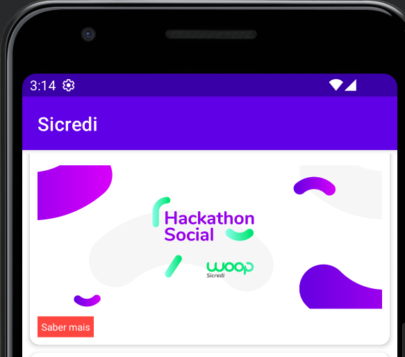

# Sicredi

Sicredi is a powerful application, a part of the Sicredi selection process. The application uses the JSON API https://5f5a8f24d44d640016169133.mockapi.io/api/events for data.

 

## Architecture

The application uses the **MVVM** (Model-View-ViewModel) architecture. This is because it allows for a clear separation of concerns, and also makes it easier to write unit tests.

###MVVM Breakdown
**Model**: This is responsible for handling the data in the application. It interacts with the database and the network, and provides relevant data to the ViewModel.
**View**: This is the UI component of the application. It observes the ViewModel for changes and updates itself accordingly.
**ViewModel**: This acts as a link between the Model and the View. It handles all UI actions and fetches data from the Model.

###Dependency Injection (DI)
Dependency Injection is used in this project to improve modularity and testability. DI allows us to pass objects to other classes instead of having them construct the objects themselves.

The Injection object in the di package is responsible for creating and providing dependencies as needed. It provides methods to generate EventDataSource, EventRepository, and EventViewModelFactory objects. This centralized object management helps in controlling the lifecycle and scope of the instances.

For example, it allows us to replace the EventDataSource with a mock version during tests.

    object Injection {

    private var eventDataSource: EventDataSource? = null
    private var eventRepository: EventRepository? = null
    private var eventViewModelFactory: EventViewModelFactory? = null

    private fun createEventDataSource(): EventDataSource {
        val dataSource = EventRemoteDataSource(ApiClient)
        eventDataSource = dataSource
        return dataSource
    }

    private fun createEventRepository(): EventRepository {
        val repository = EventRepository(provideDataSource())
        eventRepository = repository
        return repository
    }

    private fun createFactory(): EventViewModelFactory {
        val factory = EventViewModelFactory(providerRepository())
        eventViewModelFactory = factory
        return factory
    }

    private fun provideDataSource() = eventDataSource ?: createEventDataSource()
    private fun providerRepository() = eventRepository ?: createEventRepository()

    fun provideViewModelFactory() = eventViewModelFactory ?: createFactory()

    fun destroy() {
        eventDataSource = null
        eventRepository = null
        eventViewModelFactory = null
    }
}

### Libraries

The application uses the following libraries:

* **Navigation: For in-app navigation.
* **Lifecycle: For lifecycle-aware data management.
* **Glide: For image loading.
* **OkHttp: For HTTP networking.
* **Retrofit: For REST API networking.
* **Mockito: For mocking objects in tests.

And several other Android libraries for building robust and high-quality Android applications.

##Error Handling
The application includes robust error handling. Any network error or failure during encoding/decoding is caught and appropriately dealt with.

##Tests
The application includes unit tests for the ViewModel and the Repository. The tests make use of Mockito to mock the repository and the data source, allowing us to test how the ViewModel behaves given different data and different repository responses.
    
To run the tests, navigate to the EventViewModelTest class and run it.

    class EventViewModelTest {

    @Mock
    private lateinit var repository: EventRepository

    private lateinit var viewModel: EventViewModel

    @Before
    fun setup() {
        repository = mock(EventRepository::class.java)

        viewModel = EventViewModel(repository)
    }

    @Test
    fun loadEventsSuccess() {
        // Given
        val mockEvent = Event(
            id = "1",
            title = "Test Event",
            description = "This is a test event.",
            imageUrl = "http://example.com/image.jpg",
            date = 1632455687000L,
            latitude = 10.0,
            longitude = 10.0,
            price = 100.0
        )
        val events = listOf<Event>(mockEvent)
        doAnswer { invocation ->
            val callback = invocation.getArgument<OperationCallback<Event>>(0)
            callback.onSuccess(events)
            null
        }.`when`(repository).fetchEvents(any())

        // When
        viewModel.loadEvents()

        // Then
        assertFalse(viewModel.isViewLoading.value!!)
        assertEquals(events, viewModel.events.value)
        assertNull(viewModel.onMessageError.value)
    }

}

##Conclusion
Sicredi is a well-structured and robust application. It follows the MVVM architecture, uses Dependency Injection for clean and modular code, and includes a set of unit tests to ensure that everything works as expected.
